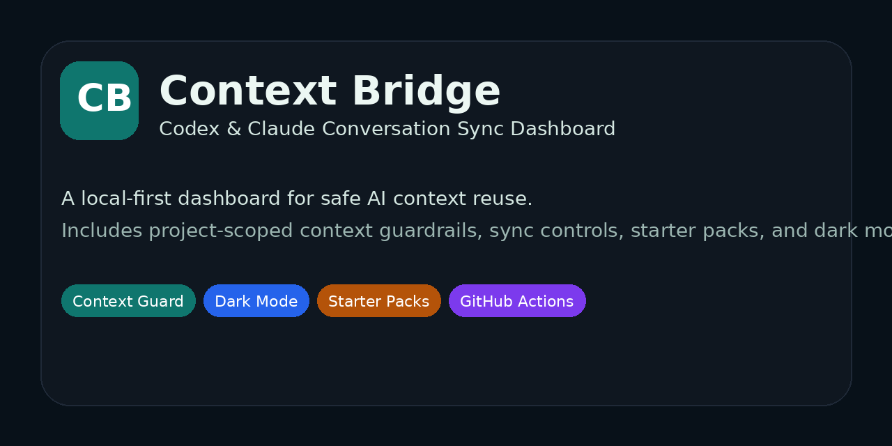
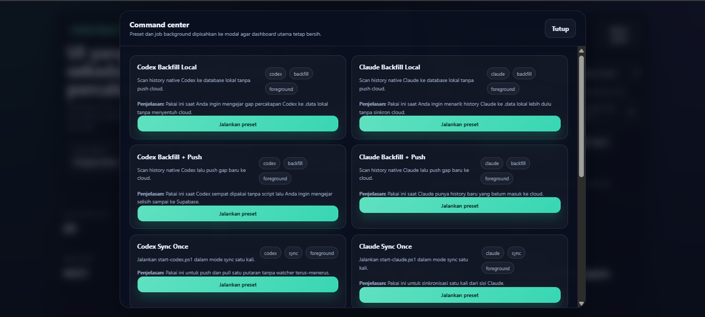
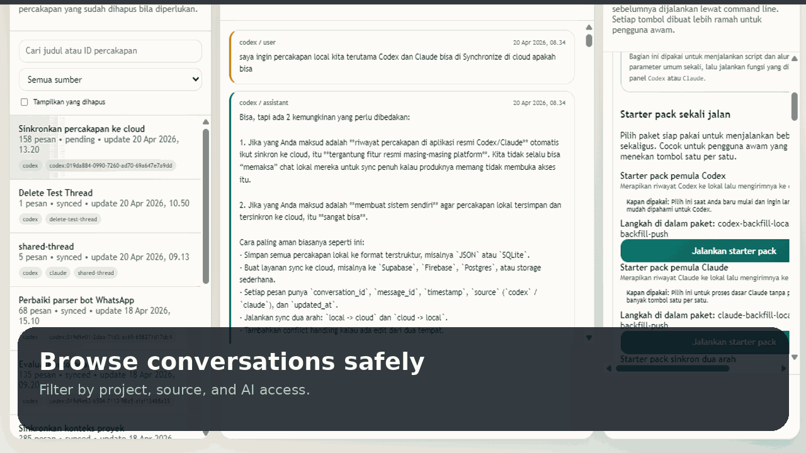

# 🧠 Context Bridge


> A local-first dashboard for syncing Codex and Claude conversations with project-scoped AI context guardrails, starter packs, native write-back tools, and a dark-mode control center.



## Why this project exists

Most AI chat tooling is great at generating answers, but weak at respecting boundaries between projects.

Without a guardrail, stored conversations can easily become:

- mixed across unrelated projects
- difficult to sync consistently
- risky to reuse as AI context
- hard to explain to non-technical teammates

**Context Bridge** solves that with a simple principle:

> AI should only read the conversations that belong to the current project and are explicitly allowed.

## Highlights

- **Context Guard** to keep AI focused on approved project conversations only
- **Codex + Claude sync workflows** with backfill, push, pull, and write-back flows
- **Starter packs** so non-technical users can run common workflows in one click
- **Dark mode dashboard** for long work sessions
- **Local-first SQLite storage** with cloud sync support
- **GitHub Actions CI** for smoke checks and asset generation
- **Open-source ready assets** including logo, social preview, and demo GIF

## Preview

### Dashboard


### Command center


### Demo GIF


## Features

### 1. Context Guard

Every conversation can be assigned:

- `project_id`
- `scope`
- `allowed_for_ai`

This lets you separate:

- project conversations
- general conversations
- private conversations
- archived conversations

The dashboard can then operate in safer modes such as:

- **Active Project + AI Allowed**
- **Active Project Only**
- **AI Allowed Only**
- **General Only**

### 2. Starter Packs

Common workflows can be launched from the dashboard without memorizing command-line flags.

Examples:

- Codex backfill to local storage
- Claude backfill plus cloud push
- one-time sync runs
- background watchers
- realtime listeners
- native write-back operations

### 3. Native write-back

Mirror approved conversations back into native Codex or Claude locations.

This is useful when you want a project thread to be reconstructed on another machine or restored into a local native environment.

### 4. Dark mode dashboard

The dashboard now includes a built-in light/dark theme toggle, stored in browser local storage.

## Project structure

```text
.
├── src/
│   ├── cli.js
│   ├── config.js
│   ├── dashboard-command-center.js
│   ├── dashboard-server.js
│   ├── history-import.js
│   ├── local-store.js
│   ├── native-writeback.js
│   ├── realtime.js
│   └── supabase-sync.js
├── docs/
│   ├── demo.gif
│   ├── logo.svg
│   ├── screenshot-command-center.png
│   ├── screenshot-dashboard.png
│   └── social-preview.png
├── scripts/
│   ├── generate_demo_assets.py
│   └── smoke-check.js
└── .github/
    └── workflows/
        └── ci.yml
```

## Getting started

### Requirements

- Node.js 18+
- npm
- Python 3 (only needed for generating demo assets)
- Windows PowerShell for the included `*.ps1` helpers

### Install dependencies

```bash
npm install
```

### Run the dashboard

```bash
node src/cli.js dashboard --port 3030
```

Or on Windows:

```powershell
.\start-dashboard.ps1
```

Then open:

```text
http://localhost:3030
```

## Quick start flow

1. Set the **Active Project** in the dashboard.
2. Choose **Active Project + AI Allowed** mode.
3. Select the conversations that belong to that project.
4. Mark only the relevant conversations as **allowed for AI**.
5. Run starter packs or write-back flows as needed.

## Demo asset generation

This repo includes a script to regenerate the demo GIF and social preview image.

```bash
npm run demo:gif
```

The script updates:

- `docs/demo.gif`
- `docs/social-preview.png`

If `docs/screenshot-dashboard.png` and `docs/screenshot-command-center.png` already exist, the GIF will use them. Otherwise it will create clean placeholders automatically.

## CI / automation

GitHub Actions runs a lightweight CI pipeline on every push and pull request:

- installs dependencies
- runs JavaScript smoke checks
- regenerates demo assets
- uploads generated docs assets as a workflow artifact

See:

```text
.github/workflows/ci.yml
```

## Troubleshooting

### `no such column: project_id`

Your SQLite database was created with an older schema.

Use the updated `src/local-store.js` with auto-migration enabled, then restart the dashboard.

If you are in a disposable dev environment, you can also remove the old database and let the app recreate it.

## Roadmap

- onboarding wizard for non-technical users
- project templates and safer defaults
- multi-project workspaces
- richer access-control flows
- polished release packaging

## Contributing

Issues and pull requests are welcome.

Good areas to contribute:

- dashboard UX
- sync reliability
- safer context isolation
- better docs and examples

## License

This project is licensed under the MIT License.
